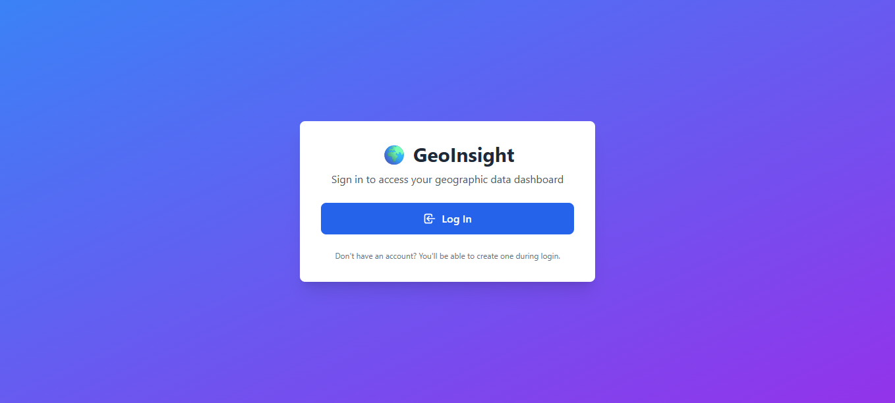
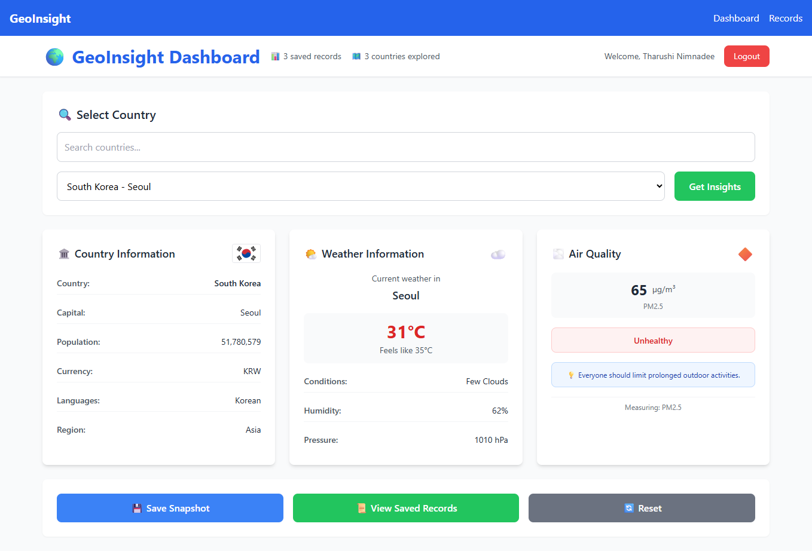
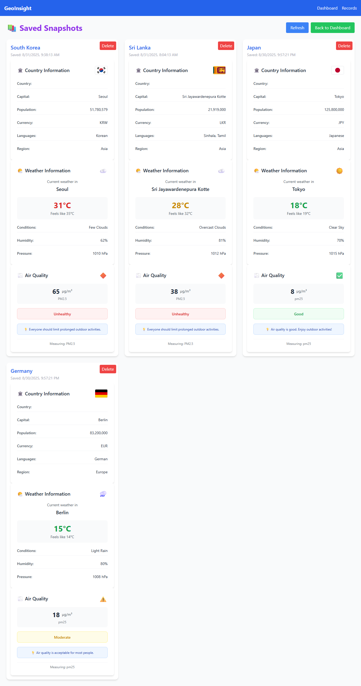

# GeoInsight Dashboard 🌍

A modern full-stack geography-based data aggregation platform that provides comprehensive insights about countries worldwide. Built with React, Vite, Node.js, Express, and MongoDB, featuring Auth0 authentication and real-time data from multiple APIs.


## ✨ Features

### 🗺️ **Country Intelligence**
- Comprehensive country metadata (capital, population, currency, languages)
- High-resolution country flags and regional information
- Geographic details and location data

### 🌦️ **Real-Time Weather Data**
- Current weather conditions and temperature
- Detailed atmospheric data (humidity, pressure, wind)
- Weather descriptions with visual indicators

### 🌫️ **Air Quality Monitoring**
- Real-time Air Quality Index (AQI) data
- Health recommendations based on air quality levels
- Pollutant level analysis

### 💾 **Data Management**
- Save country research data to personal records
- User authentication with Auth0
- MongoDB cloud storage for data persistence

### 🎨 **Modern UI/UX**
- Responsive design with Tailwind CSS
- Interactive components with loading states
- Error handling with user-friendly alerts
- Clean, modern interface

## 🏗️ Technology Stack

### **Backend**
- **Node.js + Express.js**: RESTful API server
- **MongoDB**: Document database for data storage
- **Auth0**: Authentication and authorization
- **External API Integration**: RestCountries, OpenWeatherMap, OpenAQ

### **Frontend**
- **React 18**: Component-based UI library
- **Vite**: Fast build tool and dev server
- **Tailwind CSS**: Utility-first CSS framework
- **Auth0 React SDK**: Authentication integration

## 📁 Project Structure

```
GeoInsightDashboard/
│
├── screenshots/                # Application Screenshots
│   ├── login-page.png         # Login page screenshot
│   ├── dashboard.png          # Dashboard screenshot
│   └── saved-records.png      # Saved records page screenshot
│
├── geo-backend/                 # Backend API Server
│   ├── models/
│   │   └── Record.js           # MongoDB record schema
│   ├── routes/
│   │   └── recordsRoutes.js    # API routes for records
│   ├── .env                    # Backend environment variables
│   ├── server.js               # Express server setup
│   ├── package.json
│   └── package-lock.json
│
├── geo-frontend/               # Frontend React Application
│   ├── public/
│   │   ├── favicon.ico
│   │   └── manifest.json
│   ├── src/
│   │   ├── components/         # React Components
│   │   │   ├── AirQualityCard.jsx
│   │   │   ├── CountryCard.jsx
│   │   │   ├── ErrorAlert.jsx
│   │   │   ├── LoadingSpinner.jsx
│   │   │   ├── ProtectedRoute.jsx
│   │   │   ├── SuccessAlert.jsx
│   │   │   └── WeatherCard.jsx
│   │   ├── pages/              # Page Components
│   │   │   ├── Dashboard.jsx   # Main dashboard page
│   │   │   ├── Login.jsx       # Login/authentication page
│   │   │   └── Record.jsx      # Saved records page
│   │   ├── api.js              # API service configuration
│   │   ├── App.css             # Component-specific styles
│   │   ├── App.jsx             # Main App component
│   │   ├── index.css           # Global styles
│   │   └── main.jsx            # Application entry point
│   ├── index.html              # HTML template
│   ├── package.json            # Frontend dependencies
│   ├── vite.config.js          # Vite configuration
│   ├── tailwind.config.js      # Tailwind CSS config
│   ├── postcss.config.js       # PostCSS config
│   └── eslint.config.js        # ESLint configuration
│
├── .gitignore
├── LICENSE                     # MIT License
├── README.md
├── package.json                # Root package.json
└── package-lock.json
```

## 📸 Application Screenshots

### 🔐 Login Page
*Secure authentication powered by Auth0*



### 🏠 Dashboard
*Main dashboard showing country data, weather, and air quality information*



### 💾 Saved Records
*User's saved country research data and snapshots*



## 🚀 Quick Start

### **Prerequisites**
- Node.js (v18.0.0 or higher)
- npm or yarn package manager
- MongoDB Atlas account
- Auth0 account
- OpenWeatherMap API key

### **1. Clone Repository**
```bash
git clone https://github.com/tharushi1019/GeoInsightDashboard.git
cd GeoInsightDashboard
```

### **2. Backend Setup**
```bash
cd geo-backend
npm install
```

Create `.env` file in the `geo-backend` directory:
```env
# MongoDB Configuration
MONGO_URI=your_mongodb_connection_string

# Server Configuration
PORT=5000

# API Keys
BACKEND_API_KEY=your_secure_backend_api_key
VITE_OPENWEATHERMAP_KEY=your_openweathermap_api_key

# CORS
FRONTEND_URL=http://localhost:5173

# Auth0 Configuration
AUTH0_ISSUER_BASE_URL=https://your-domain.us.auth0.com
AUTH0_AUDIENCE=your_auth0_audience
```

### **3. Frontend Setup**
```bash
cd ../geo-frontend
npm install
```

Create `.env` file in the `geo-frontend` directory:
```env
# Auth0 Configuration
VITE_AUTH0_DOMAIN=your-domain.us.auth0.com
VITE_AUTH0_CLIENT_ID=your_auth0_client_id
VITE_AUTH0_AUDIENCE=your_auth0_audience

# API Configuration
VITE_API_BASE_URL=http://localhost:5000/api
VITE_BACKEND_API_KEY=your_secure_backend_api_key

# External API Keys
VITE_OPENWEATHERMAP_KEY=your_openweathermap_api_key
```

### **4. Start Development Servers**

**Backend Server:**
```bash
cd geo-backend
npm run dev
# Server runs on http://localhost:5000
```

**Frontend Server:**
```bash
cd geo-frontend
npm run dev
# Application runs on http://localhost:5173
```

## 📜 Available Scripts

### **Backend (geo-backend)**
```bash
npm start       # Start production server
npm run dev     # Start development server with nodemon
```

### **Frontend (geo-frontend)**
```bash
npm run dev     # Start Vite development server
npm run build   # Build for production
npm run preview # Preview production build
npm run lint    # Run ESLint
npm run lint:fix # Auto-fix ESLint issues
```

## 🔧 API Endpoints

### **Records Routes**
```
GET    /api/records     # Get user's saved records
POST   /api/records     # Save new country data record
DELETE /api/records/:id # Delete a specific record
```

### **Request Examples**

**Save a Record:**
```bash
POST /api/records
Content-Type: application/json
Authorization: Bearer <auth0_token>

{
  "country": "Japan",
  "countryData": {
    "name": "Japan",
    "capital": "Tokyo",
    "population": 125800000,
    "flag": "https://flagcdn.com/w320/jp.png"
  },
  "weatherData": {
    "temperature": 22,
    "description": "Clear sky",
    "humidity": 65
  },
  "airQualityData": {
    "aqi": 42,
    "status": "Good"
  }
}
```

## 🗄️ Database Schema

### **Record Model (MongoDB)**
```javascript
{
  _id: ObjectId,
  userId: String,           // Auth0 user identifier
  country: String,          // Country name
  countryData: {
    name: String,
    capital: String,
    population: Number,
    flag: String,
    // Additional country metadata
  },
  weatherData: {
    temperature: Number,
    description: String,
    humidity: Number,
    // Additional weather data
  },
  airQualityData: {
    aqi: Number,
    status: String,
    // Additional air quality data
  },
  createdAt: { type: Date, default: Date.now },
  updatedAt: { type: Date, default: Date.now }
}
```

## 🎨 Key Components

The application is built with reusable React components:

- **`CountryCard.jsx`**: Displays country information and metadata
- **`WeatherCard.jsx`**: Shows current weather conditions
- **`AirQualityCard.jsx`**: Presents air quality index and health info
- **`LoadingSpinner.jsx`**: Loading state indicator
- **`ErrorAlert.jsx`**: Error message display
- **`SuccessAlert.jsx`**: Success notification component
- **`ProtectedRoute.jsx`**: Route protection with Auth0

## 🔐 Authentication

The application uses **Auth0** for secure authentication:

1. Users log in through Auth0 hosted login page
2. Auth0 returns a JWT token
3. Frontend stores token and includes it in API requests
4. Backend validates tokens for protected routes
5. User data is associated with Auth0 user ID

## 🌟 External APIs Used

| API Service | Purpose | Documentation |
|-------------|---------|---------------|
| **RestCountries** | Country metadata and flags | [restcountries.com](https://restcountries.com) |
| **OpenWeatherMap** | Real-time weather data | [openweathermap.org/api](https://openweathermap.org/api) |
| **OpenAQ** | Air quality monitoring | [docs.openaq.org](https://docs.openaq.org/) |

## 🚀 Deployment

### **Backend Deployment (Railway/Render/Heroku)**
1. Connect your GitHub repository
2. Set environment variables in the platform
3. Deploy from the `geo-backend` directory
4. Ensure MongoDB Atlas is accessible

### **Frontend Deployment (Vercel/Netlify)**
1. Build the application: `npm run build`
2. Deploy the `dist` folder
3. Set environment variables for production
4. Configure redirects for single-page application

## 🧪 Testing

```bash
# Frontend tests
cd geo-frontend
npm test

# Backend tests
cd geo-backend
npm test
```

## 🤝 Contributing

1. Fork the repository
2. Create a feature branch: `git checkout -b feature/your-feature-name`
3. Make your changes
4. Test your changes
5. Commit: `git commit -m 'Add some feature'`
6. Push: `git push origin feature/your-feature-name`
7. Create a Pull Request

## 🔮 Future Enhancements

- [ ] Interactive world map integration
- [ ] Historical data tracking and trends
- [ ] Data visualization charts
- [ ] Export functionality for saved records
- [ ] Mobile app development
- [ ] Multi-language support
- [ ] Push notifications for weather alerts

## 📝 License

This project is licensed under the MIT License - see the [LICENSE](LICENSE) file for details.

## 🙏 Acknowledgments

- [RestCountries API](https://restcountries.com) for comprehensive country data
- [OpenWeatherMap](https://openweathermap.org) for weather information  
- [OpenAQ](https://openaq.org) for air quality data
- [Auth0](https://auth0.com) for authentication services
- [MongoDB Atlas](https://mongodb.com/atlas) for cloud database hosting
- [Vite](https://vitejs.dev) for the excellent build tool

---

**Built with ❤️ using modern web technologies**

*This project demonstrates full-stack development best practices with React, Node.js, and secure authentication while providing valuable geographical insights.*